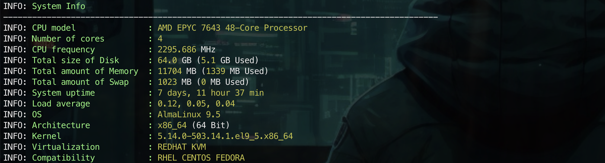
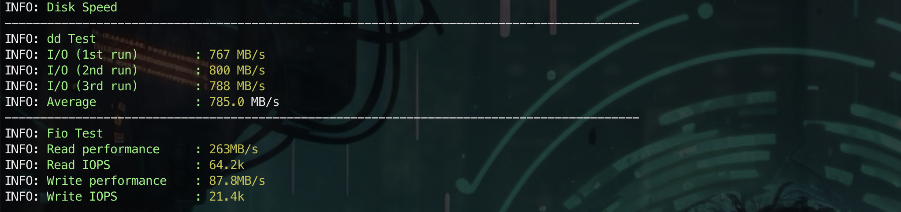
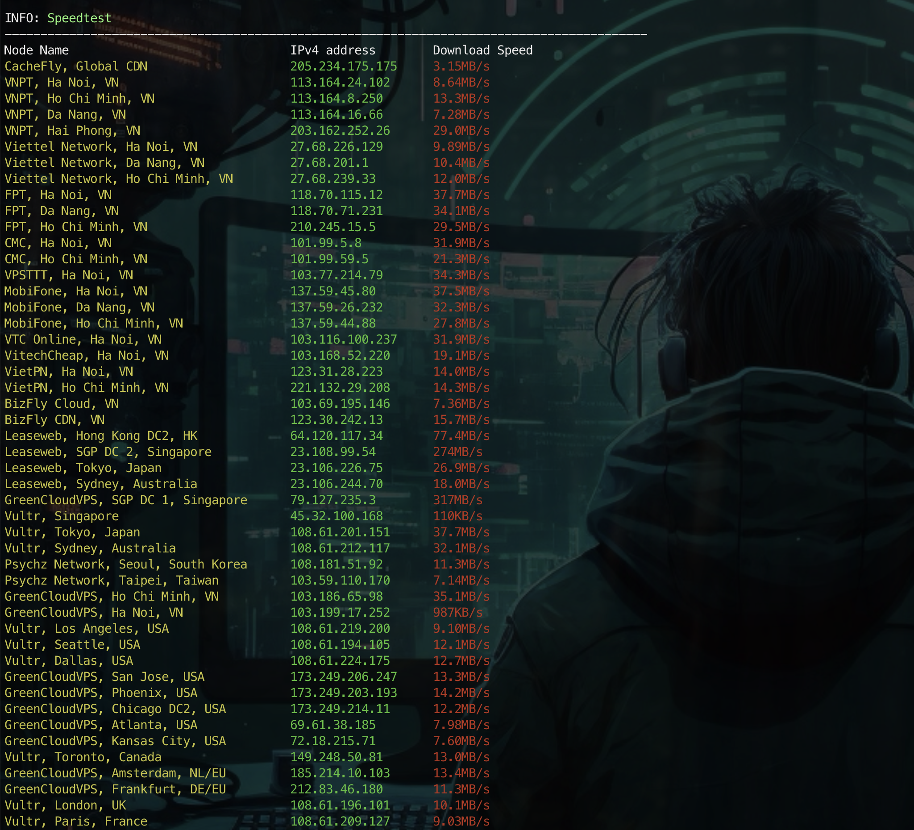
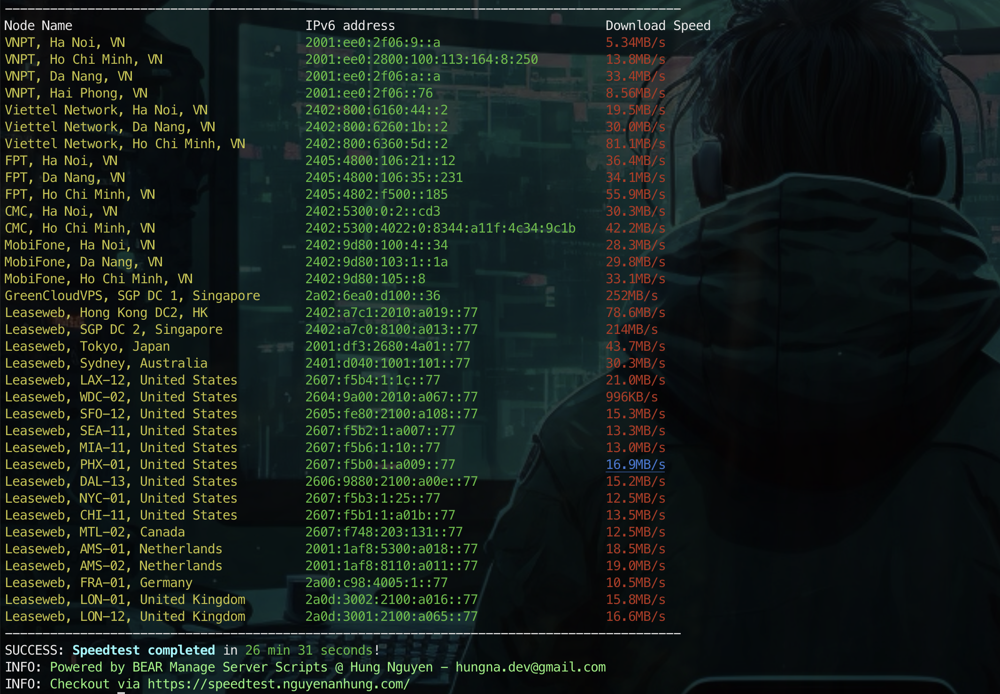

# Server / VPS Speedtest

### BEAR Server Speedtest Scripts

Bạn có thể chạy 1 trong 2 lệnh dưới

```shell
curl -H "Cache-Control: no-cache" -Lso- https://bash.nguyenanhung.com/speedtest | bash
```

hoặc

```shell
curl -H "Cache-Control: no-cache" -Lso- https://raw.githubusercontent.com/nguyenanhung/speedtest/refs/heads/main/speedtest | bash
```

1. Lệnh này sẽ tự động kiểm tra, cài đặt các gói cần thiết và tiến hành sử dụng đường truyền của 3 nhà mạng lớn nhất là
   VNPT, Viettel, FPT trên khắp 3 miền
2. Đồng thời cũng sẽ tiến hành kiểm tra chéo với các datacenter trên khắp thế giới: USA, EU, APAC...
3. Tiến hành test cùng lúc IPv4 và IPv6 nếu Server/VPS của bạn có hỗ trợ
4. Chỉ với một dòng lệnh duy nhất, bạn sẽ có cái nhìn đánh giá tổng quan về server.
5. Thông tin được lưu trong file log có đường dẫn ~/server-speedtest.log
6. Scripts không gửi bất cứ thông tin nào về máy chủ của chúng tôi, cũng ko share đi đâu cả, vì vậy có thể yên tâm sử
   dụng ở các máy chủ enterprise mà không lo ngại vấn đề policy

#### Hình ảnh demo






### Kiểm tra tốc độ bằng `speedtest-cli` trên macOS

```shellbrew tap teamookla/speedtest
brew update
# Example how to remove conflicting or old versions using brew
# brew uninstall speedtest --force
# brew uninstall speedtest-cli --force
brew install speedtest --force
```

Tiến hành cài đặt công cụ `Speedtest CLI` theo hướng dẫn bên trên. Sau đó chạy `speedtest` để kiểm tra tốc độ mạng.

### Kiểm tra tốc độ bằng `speedtest-cli` trên Ubuntu/Debian

```shell
## If migrating from prior bintray install instructions please first...
# sudo rm /etc/apt/sources.list.d/speedtest.list
# sudo apt-get update
# sudo apt-get remove speedtest
## Other non-official binaries will conflict with Speedtest CLI
# Example how to remove using apt-get
# sudo apt-get remove speedtest-cli
sudo apt-get install curl
curl -s https://packagecloud.io/install/repositories/ookla/speedtest-cli/script.deb.sh | sudo bash
sudo apt-get install speedtest
```

Tiến hành cài đặt công cụ `Speedtest CLI` theo hướng dẫn bên trên. Sau đó chạy `speedtest` để kiểm tra tốc độ mạng.

### Kiểm tra tốc độ bằng `speedtest-cli` trên Fedora/CentOS/RHEL-Based

```shell
## If migrating from prior bintray install instructions please first...
# sudo rm /etc/yum.repos.d/bintray-ookla-rhel.repo
# sudo yum remove speedtest
## Other non-official binaries will conflict with Speedtest CLI
# Example how to remove using yum
# rpm -qa | grep speedtest | xargs -I {} sudo yum -y remove {}
curl -s https://packagecloud.io/install/repositories/ookla/speedtest-cli/script.rpm.sh | sudo bash
sudo yum install speedtest
```

Tiến hành cài đặt công cụ `Speedtest CLI` theo hướng dẫn bên trên. Sau đó chạy `speedtest` để kiểm tra tốc độ mạng.

### Kiểm tra tốc độ bằng `speedtest-cli` trên FreeBSD

```shell
sudo pkg update && sudo pkg install -g libidn2 ca_root_nss
# Example how to remove conflicting or old versions using pkg
# sudo pkg remove speedtest
# freeBSD 12 install
sudo pkg add "https://install.speedtest.net/app/cli/ookla-speedtest-1.2.0-freebsd12-x86_64.pkg"
# freeBSD 13 install
sudo pkg add "https://install.speedtest.net/app/cli/ookla-speedtest-1.2.0-freebsd13-x86_64.pkg"
```

Tiến hành cài đặt công cụ `Speedtest CLI` theo hướng dẫn bên trên. Sau đó chạy `speedtest` để kiểm tra tốc độ mạng.

## Notes️

Dự án này có tham khảo và lấy cảm hứng từ tocdo.net của Luân Trần với nhiều cải tiến và bổ sung cho phù hợp tình hình
thực tế và nhu cầu sử dụng!

## Contact

| Name        | Email                | GitHub        | Facebook      |
|-------------|----------------------|---------------|---------------|
| Hung Nguyen | dev@nguyenanhung.com | @nguyenanhung | @nguyenanhung |

From 🐼 Bear Family with Love ♥️
